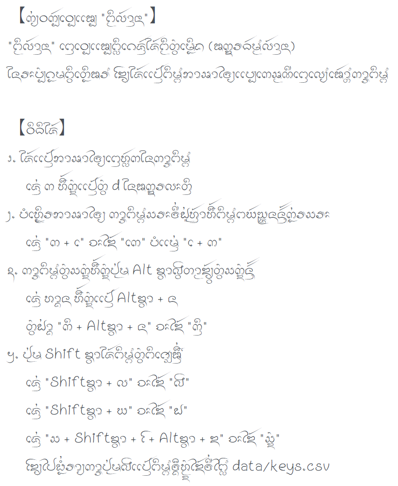

---

# ᨠ᩠᩵ᨿᩅᨠᩢ᩠ᨷᩅᩮ᩠ᨷᩋᩯ᩠ᨷ "ᨻᩥᨾ᩠ᨻ᩺ᩃ᩶ᩣ᩠ᨶᨶᩣ"
"ᨻᩥᨾ᩠ᨻ᩺ᩃ᩶ᩣ᩠ᨶᨶᩣ" ᨸᩮ᩠ᨶᩅᩮ᩠ᨷᩋᩯ᩠ᨷᨻ᩠ᩃᩥᨣᩮᨩᩢ᩠ᨶᨩᩲ᩶ᨻᩥᨾ᩠ᨻ᩺ᨲᩫ᩠ᩅᨾᩮᩬᩥᨦ (ᩋᨠ᩠ᨡᩁᨵᩢᨾ᩠ᨾᩃ᩶ᩣ᩠ᨶᨶᩣ) ᨶᩲᩁᩡᨷᩫ᩠ᨷᨣᩬᨾᨻᩥ᩠ᩅᨴᩮᩥᩬᩁ᩺ ᨯᩰ᩠ᨿᨩᩲ᩶ᨸᩯ᩠᩶ᨶᨻᩥᨾ᩠ᨻ᩺ᨽᩣᩇᩣᨴᩱ᩠ᨿᨷᩯ᩠ᨷᨠᩮᩇ᩠ᨾᨱᩦᨸᩮ᩠ᨶᩉ᩠ᩃᩢᨠᨶᩲᨠᩣ᩠ᩁᩅᩣ᩠ᨦᨸᩩ᩵ᨾ

# ᩅᩥᨵᩦᨩᩲ᩶
᪁. ᨸᩩ᩵ᨾᨲᩫ᩠ᩅᨻᨿᩢᨬ᩠ᨩᨶᨧᩡᨲᩕᩫ᩠ᨦᨠᩢ᩠ᨷᨸᩯ᩠᩶ᨶᨽᩣᩇᩣᨴᩱ᩠ᨿ
　ᨩᩮ᩠᩵ᨶ "ᨠ" ᩉᩨ᩶ᨠᩫ᩠ᨯᨸᩯ᩠᩶ᨶ "ก"
᪂. ᨲᩣ᩠ᨾᩃᩢᨠ᩠ᩇᨱᨴ᩠ᩅᩫ᩵ᨻᩱᨡᩬᨦᨿᩪᨶᩥᨣᩰ᩠ᨯᨴᩱ᩠ᨿᨵᩢᨾ᩠ᨾ᩺ ᨠᩣ᩠ᩁᨻᩥᨾ᩠ᨻ᩺ᩈᩕᨴᩦ᩵ᩀᩪ᩵ᩉ᩠ᨶ᩶ᩣᨻᨿᩢᨬ᩠ᨩᨶ ᩉᩨ᩶ᨠᩫ᩠ᨯᨲᩫ᩠ᩅᨻᨿᩢᨬ᩠ᨩᨶᨠᩬ᩵ᩁᩈᩕᨶᩢ᩠᩶ᨶ
　ᨩᩮ᩠᩵ᨶ "ᨠᩮ" ᩉᩨ᩶ᨠᩫ᩠ᨯ "ᨠ +  ᩮ" ᨷᩴ᩵ᨾᩯ᩠᩵ᨶ " ᩮ + ᨠ"
᪃. ᨠᩣ᩠ᩁᨻᩥᨾ᩠ᨻ᩺ᨲᩫ᩠ᩅᨩᩮᩥ᩠ᨦ ᩉᩨ᩶ᨠᩫ᩠ᨯᨸᩩ᩵ᨾ Alt ᨡ᩠ᩅᩣᩓ᩠ᩅᨲᩣ᩠ᨾᨯ᩠᩶ᩅ᩠ᨿᨲᩫ᩠ᩅᨩᩮᩥ᩠ᨦᨶᩢ᩠᩶ᨶ
　ᨩᩮ᩠᩵ᨶ ᩉᩣ᩠ᨦᨶᩡ ᩉᩨ᩶ᨠᩫ᩠ᨯᨸᩯ᩠᩶ᨶ Alt ᨡ᩠ᩅᩣ + ᨶ
　ᨲᩫ᩠ᩅᩀ᩵ᩣ᩠ᨦ "ᨠᩥ᩠ᨶ" ᩉᩨ᩶ᨠᩫ᩠ᨯ "ᨠ + Altᨡ᩠ᩅᩣ + ᨶ"
᪄. ᨲᩫ᩠ᩅᩅᩥᩆᩮ᩠ᩇᩋᩨ᩠᩵ᨶ᩻ᨴᩦ᩵ᨷᩴ᩵ᨾᩦᨶᩲᨸᩯ᩠᩶ᨶᨽᩣᩇᩣᨴᩱ᩠ᨿ ᨧᩡᨻᩱᩀᩪ᩵ᨠᩢ᩠ᨶᨴᩦ᩵ᨸᩩ᩵ᨾ Shift ᨡ᩠ᩅᩣ ᨷ᩠ᩅᨲᩣ᩠ᨾᨯ᩠᩶ᩅ᩠ᨿᨸᩩ᩵ᨾᨴᩦ᩵ᨠᩴᩣᩉ᩠ᨶᩫᨯ᩺
　ᨩᩮ᩠᩵ᨶ "Shiftᨡ᩠ᩅᩣ + ᩃ" ᨧᩡᨯᩱ᩶ "ᩓ"
　ᨩᩮ᩠᩵ᨶ "Shiftᨡ᩠ᩅᩣ + ᨿ" ᨧᩡᨯᩱ᩶ "ᩀ"
　ᨩᩮ᩠᩵ᨶ "Shiftᨡ᩠ᩅᩣ + ᩈ" ᨧᩡᨯᩱ᩶ "ᩔ"
　ᨲᩫ᩠ᩅᩀ᩵ᩣ᩠ᨦ "ᩓ᩠ᩅ" ᩉᩨ᩶ᨠᩫ᩠ᨯ "Shiftᨡ᩠ᩅᩣ + ᩃ + Altᨡ᩠ᩅᩣ + ᩅ"
　ᩁᩣ᩠ᨿᨠᩣ᩠ᩁᨲᩫ᩠ᩅᨶᩲᩉ᩠ᨾᩪ᩵ Shift ᨡ᩠ᩅᩣ ᨴᩢ᩠᩶ᨦᩉ᩠ᨾᩫᨯᨹᩬᩴ᩵ᨯᩱ᩶ᨴᩦ᩵ᨼᩱ᩠ᩃ᩺ data/keys.csv ᨶᩲᨠᩥ᩠ᨴᩉᩢ᩠ᨷ
